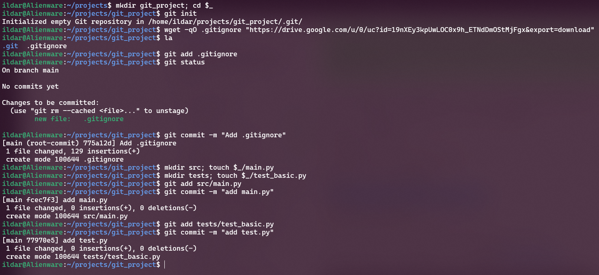
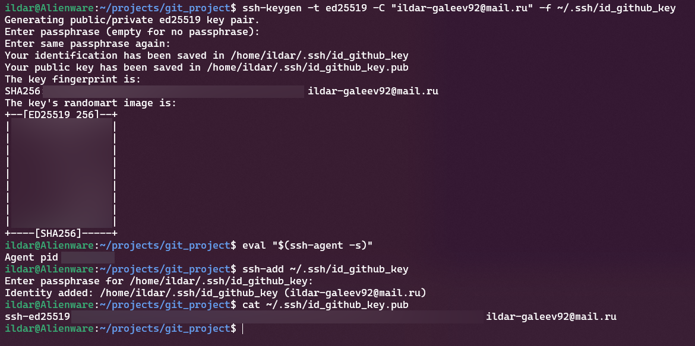
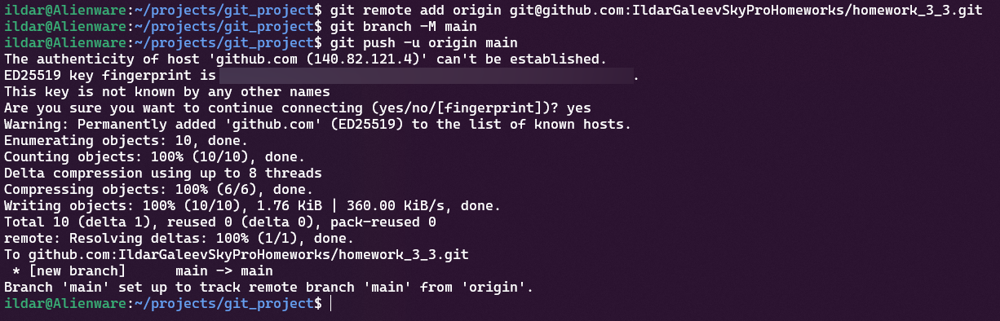
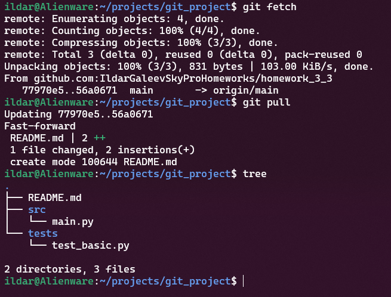
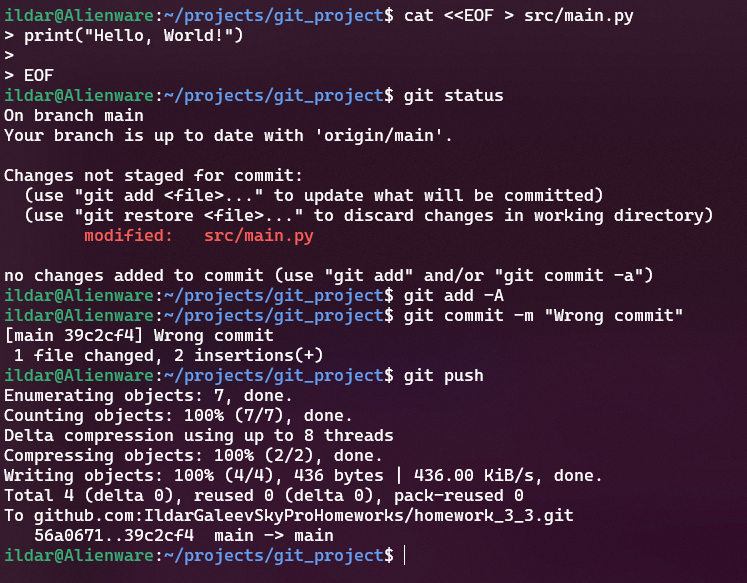
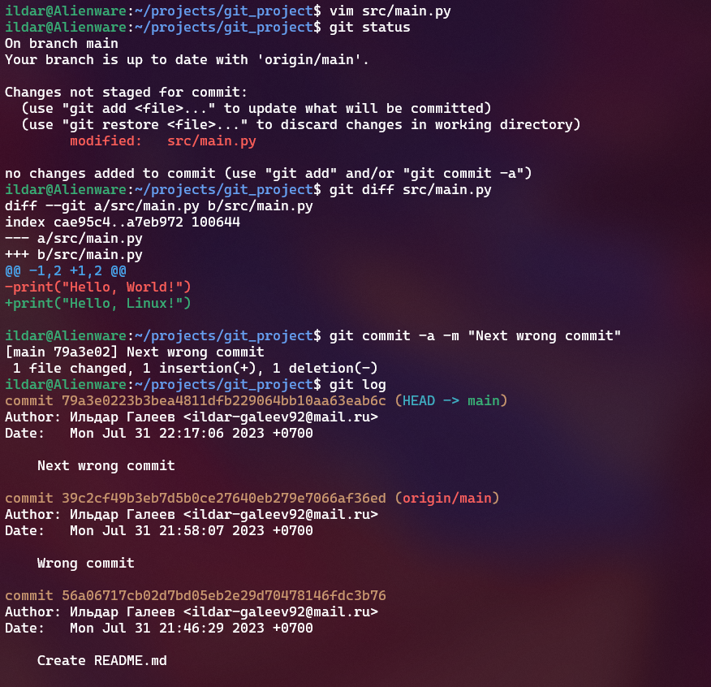
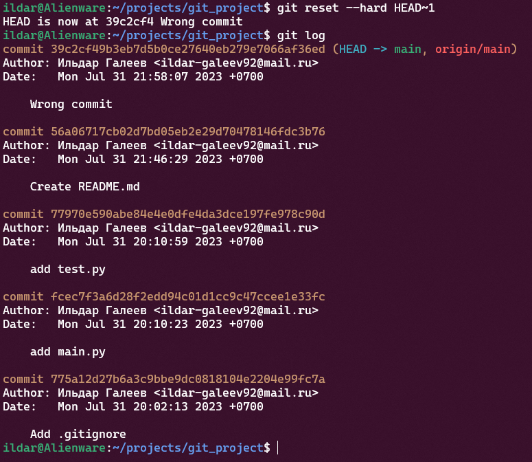
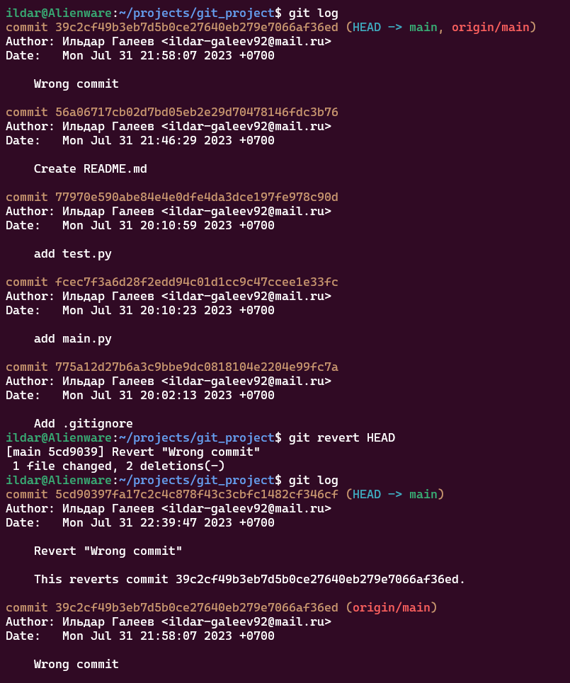
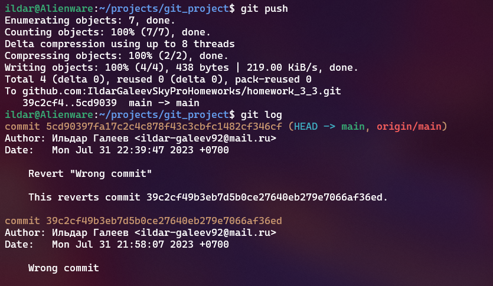

# Урок 11.1. Введение в работу с Git - домашнее задание

1. Создаем папку с проектом
2. Инициализируем git репозиторий
3. Скачиваем `.gitignore`
4. Добавляем `.gitignore` в отслеживание и коммитим изменения

``` bash
mkdir git_project; cd $_
git init
wget -qO .gitignore "https://drive.google.com/u/0/uc?id=19nXEy3kpUwLOC0x9h_ETNdDmOStMjFgx&export=download"
la
git add .gitignore
git status
git commit -m "Add .gitignore"
```

5. Создаем файлы  `src/main.py` и `tests/test_basic.py`

``` bash
mkdir src; touch $_/main.py
mkdir tests; touch $_/test_basic.py
```

6. Коммитим изменения для `main.py`

``` bash
git add src/main.py
git commit -m "add main.py"
```

7. Коммитим изменения для `test.py`

``` bash
git add tests/test_basic.py
git commit -m "add test.py"
```



8. Генерируем и добавляем ssh-ключ для GitHub

``` bash
ssh-keygen -t ed25519 -C "ildar-galeev92@mail.ru" -f ~/.ssh/id_github_key
eval "$(ssh-agent -s)"
ssh-add ~/.ssh/id_github_key
cat ~/.ssh/id_github_key.pub
```



9. Привязываем к проекту удаленный репозиторий
10. Отправляем изменения в удаленный репозиторий

``` bash
git remote add origin git@github.com:IldarGaleevSkyProHomeworks/homework_3_3.git
git branch -M main
git push -u origin main
```



11. Притягиваем изменения из удаленного репозитория и применяем их к локальному

``` bash
git fetch
git pull
```



12. Делаем ошибочный коммит

``` bash
cat <<EOF > src/main.py
print("Hello, World!")
EOF
git commit -a -m "Wrong commit"
git push
```



13. Еще один ошибочный локальный коммит



14. Отмена локального коммита

``` bash
git reset --hard HEAD~1
```



15. Делаем коммит, обратный последнему

``` bash
git revert HEAD
```



16. Пушим изменения в удаленный репозиторий

``` bash
git push
```


